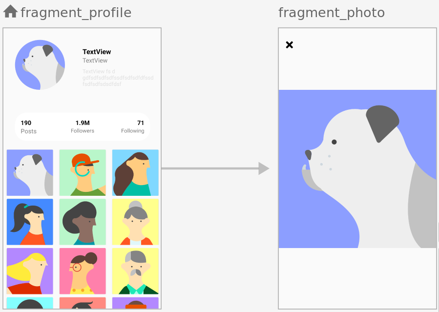

## simple Task (Bit Task)

*Technical Requirements*

— Fetch data from both APIs (User info api 

& media data api)

— When the user presses on photo, it 

should open in full screen

— A page can contain many photos at 

once, when user scrolls, 

the info bar info should be sticked to the 

top (Posts, Followers, Following), 

and the user details should hide

( As show in picture below )

APIs URLS:

http://i0sa.com/bit/task/home

http://i0sa.com/bit/task/profile
